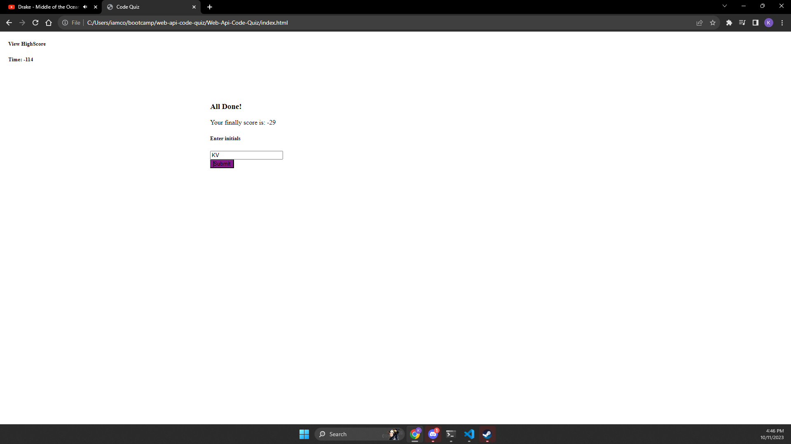

# Web-Api-Code-Quiz

This project was the biggest head scratcher of all time. 
I spent way to much time over thinking things and trying to make this thing exactly how the instructor example looked in the read me. 
I probably should have branched out and been more creative but maybe for another time. 

But I will go ahead and talk about what I have done to get to where this project is. 
I started off with just adding the starter code for the files such as the HTML, CSS, and JS. 

Then I started with the html and I didnt no much I just added the bare bones and I looked at some of my old work to get it set up to where its at now. I mainly looked at most of the activities that we did last week to get a good base. 

For the CSS styling I probably took the longest time on this step then any other step. I started on w3 schools for CSS styling and then full stack but I wasnt getting much from them so I used past projects and activites and most of the CSS is copy and pasted from the activites we did. I took way to long because like I said above I wanted it to look like the example we got I dont think the colors are the same but I played with that for a while and I like how it looks and think its pretty close. 

For the JS I am not going to lie that is mostly copy and pasted content from really only last weeks activities they really are the best references for building from the ground up. I like doing JS more than CSS so it took me a while but I got it to work the way I wanted it to. 

Now for the fuction of the app it will:

GIVEN I am taking a code quiz
WHEN I click the start button
THEN a timer starts and I am presented with a question
WHEN I answer a question
THEN I am presented with another question
WHEN I answer a question incorrectly
THEN time is subtracted from the clock
WHEN all questions are answered or the timer reaches 0
THEN the game is over
WHEN the game is over
THEN I can save my initials and my score

I think it hit all the needs and wants for this project but you never know till its graded. 
I didnt really end up using any sources other than my work in the Ku bootcamp repo. But I do really enjoy using the w3 schools and stack overflow websites for help with styling ideas. I will put the sources to the websites I used. 

Sources

https://www.w3schools.com/

https://stackoverflow.com/questions/4000792/how-can-i-style-code-listings-using-css

Below is a screenshot of the project. 
